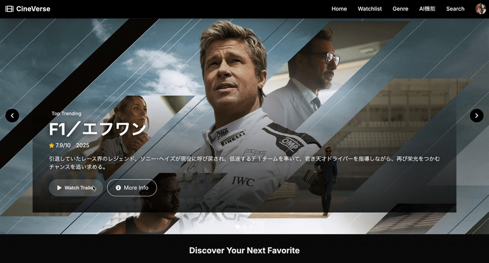
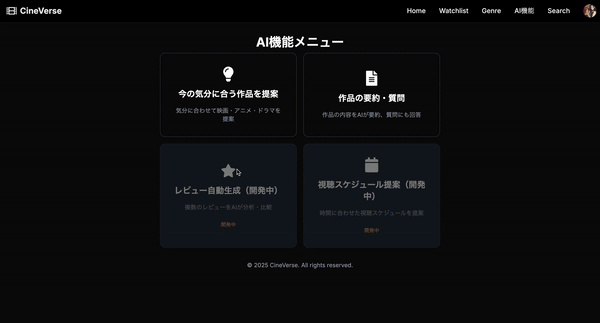
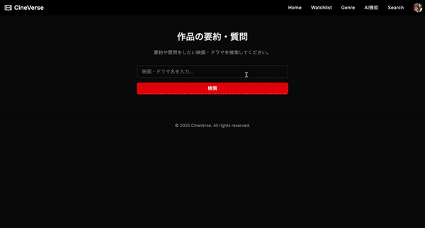
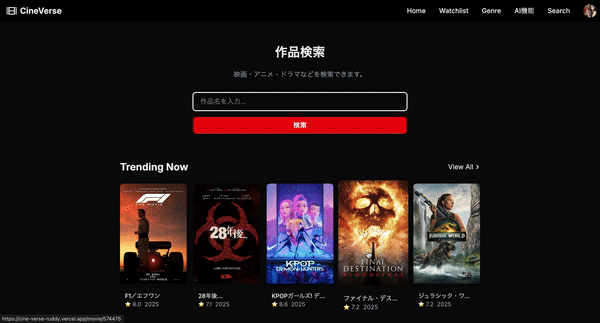
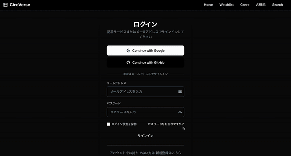
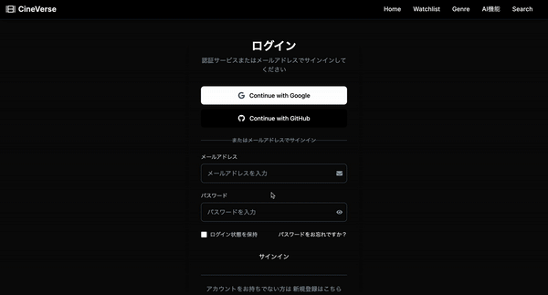
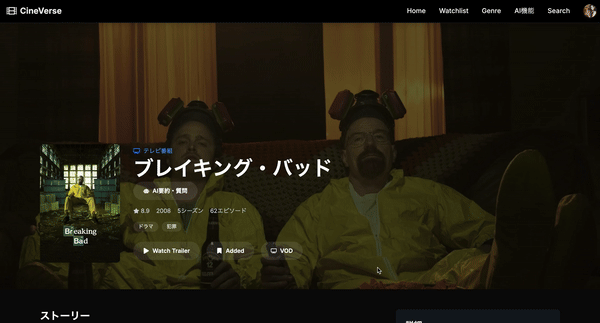

# 🎬 CineVerse


## 🏷️ バージョン管理・差分の見方

- 本リポジトリは、各バージョンごとにタグ・リリースノート・issueを整理しています。
- **バージョン間の差分は[こちら](https://github.com/xxnaokixx-zzz/CineVerse/compare/v1.0.0...v1.6.0)から確認できます。**
- 各リリースの詳細は[リリース一覧](https://github.com/xxnaokixx-zzz/CineVerse/releases)をご覧ください。
- issueは「バージョンごとに完了した実装内容」を記録しています。

> **テストアカウント（デモ用）**  
> Email: demo@example.com  
> Password: password1234  
> ※ ゲストモードも利用可能です

## 🗂️ バージョン履歴（主な進化）

| バージョン | 主な内容 |
|:---:|:---|
| v1.0.0 | プロジェクト初期化・基本設計 |
| v1.1.0 | 基本機能の実装・認証システム |
| v1.2.0 | UI/UX改善・機能強化 |
| v1.3.0 | 基盤機能の確立・UI/UX改善 |
| v1.4.0 | 検索機能の新規実装・強化 |
| v1.5.0 | 認証バグ修正・ログアウトリダイレクト機能 |
| v1.6.0 | 検索機能のUX改善・人物名検索の自動判定 |

## 📑 目次

- [デモ](#-デモ)
- [主な機能](#-主な機能)
- [これまでの主な作業まとめ](#-これまでの主な作業まとめ)
- [セットアップ手順](#-セットアップ手順)
- [開発環境](#-開発環境)
- [主要なページURL例](#-主要なページurl例)
- [ライセンス](#-ライセンス)
- [コントリビューション](#-コントリビューション)
- [スクリーンショット](#-スクリーンショット)
- [GIF・動画によるスクリーンショット例](#-gif・動画によるスクリーンショット例)
- [今後のロードマップ](#-今後のロードマップ)
- [FAQ（よくある質問）](#-faqよくある質問)
- [コントリビューションガイド](#-コントリビューションガイド)
- [クレジット・謝辞](#-クレジット謝辞)
- [スクリーンショットの説明](#-スクリーンショットの説明)
- [開発者・運営者](#-開発者運営者)
- [バージョン情報・更新履歴](#-バージョン情報更新履歴)
- [UI/UXへのこだわりと改善ポイント](#-uiuxへのこだわりと改善ポイント)
- [動作確認・テストについて](#-動作確認テストについて)
- [AI機能について](#-ai機能について)
- [サポート](#-サポート)

## 🚀 デモ
[CineVerseを体験する](https://cine-verse-ruddy.vercel.app)

映画・アニメ・ドラマの情報を検索・発見できるWebアプリです。  
AIによるおすすめ提案や要約機能も搭載し、ユーザーの好みに合わせた作品探しをサポートします。

---

## 🔍 主な機能

- 映画・アニメ・ドラマの横断検索
- トレンド作品の表示
- 作品詳細ページ（ポスター・あらすじ・評価・VOD配信情報など）
- ウォッチリスト管理（追加・削除・一覧表示）
- アカウント管理（プロフィール編集・削除）
- **認証機能**
  - メールアドレス/パスワード認証
  - Google認証
  - GitHub認証
  - **v1.5.0で大幅改善**: セッション管理・エラーハンドリング強化、自動ログアウト問題を解決
- **検索機能**
  - 作品名・人物名（俳優・監督・声優など）で横断検索
  - **v1.6.0で大幅改善**: 人物名の自動判定・検索結果の自動分類・効率的なナビゲーション
  - サジェスト（オートコンプリート）機能
  - 検索種別（作品検索・出演作品検索・出演者検索）の切り替え
- **AI機能**
  - 気分やジャンルに合わせたおすすめ作品提案
  - 作品の要約・質問応答（AIによる自然言語回答）
  - レビュー自動生成（開発中）
  - 視聴スケジュール提案（開発中）
- マルチデバイス対応（PC/スマホ/タブレット）
- ダークテーマUI

---

## 🚀 セットアップ手順

```bash
git clone https://github.com/xxnaokixx/CineVerse.git
cd CineVerse
npm install
npm run dev
```

* `.env.local` に必要な環境変数を設定してください（例: `NEXT_PUBLIC_SUPABASE_URL`、`NEXT_PUBLIC_SUPABASE_ANON_KEY`、`OPENAI_API_KEY`など）。
* 開発サーバーは `http://localhost:3000` で起動します。

---

## 🔐 ログインについて

本サービスは認証機能を実装していますが、ログインせずに操作できる「ゲストモード」もご用意しています。
ログイン状態での操作を確認したい場合は、以下のテストアカウントをご利用ください。

- **Email**: demo@example.com
- **Password**: password1234

※ ゲストモードでは一部機能が制限される場合があります。
※ このアカウントは開発・デモ用です。実際のサービスでは使用しないでください。

---

## 🧑‍💻 開発環境

| 項目      | 使用技術                   |
| ------- | ---------------------- |
| フレームワーク | Next.js 15.x           |
| 言語      | TypeScript, React 18.x |
| スタイリング  | Tailwind CSS           |
| バックエンド  | Supabase（認証・DB）        |
| AI連携    | OpenAI API             |
| デプロイ    | Vercel（予定または済）         |

---

## 🔗 主要なページURL例

| パス                          | 内容                  |
| --------------------------- | ------------------- |
| `/`                         | トップページ（トレンド・検索フォーム） |
| `/search`                   | 作品検索ページ             |
| `/ai`                       | AI機能メニュー            |
| `/movies` `/anime` `/drama` | 各カテゴリ一覧ページ          |
| `/movie/[id]` `/tv/[id]`    | 作品詳細ページ             |
| `/account`                  | アカウント管理ページ          |
| `/watchlist`                | ウォッチリスト             |

---

## 📝 ライセンス

このプロジェクトは **MITライセンス** のもとで公開されています。
詳細は [LICENSE](./LICENSE) ファイルをご覧ください。

---

## 🤝 コントリビューション

バグ報告・機能提案・プルリクエストは大歓迎です！
以下の手順でご参加ください：

1. Issueを確認または新規作成してください
2. `fork` → `feature/your-branch` で作業ブランチを作成
3. 実装とテスト後にプルリクエストを提出

---

## スクリーンショット

### トップページ


### 検索結果ページ


### 作品詳細ページ


### AI機能ページ


### AIレコメンドページ


### AI要約・質問ページ


### ウォッチリストページ


### アカウントページ


### トレイラー再生デモ：


---

## 🖼️ GIF・動画によるスクリーンショット例

- AIおすすめ機能の流れ：
  
- AI要約・質問応答の体験：
  
- ウォッチリスト追加・削除の流れ：
  
- 検索機能の体験：
  
- アカウント作成・ログインの流れ（Google認証）：
  
- アカウント作成・ログインの流れ（GitHub認証）：
  
- VODボタンから配信サービス一覧を表示：
  

---

## 🛣️ 今後のロードマップ
- レビュー自動生成機能の正式リリース
- モバイルUIのさらなる最適化
- 国際化（i18n）対応の拡充（※現状は未対応）
- ダーク/ライトテーマ切り替え
- おすすめAIの精度向上

---

## ❓ FAQ（よくある質問）

**Q. AI機能が動かない/エラーになる**  
A. OpenAI APIキーやSupabaseの設定が正しいかご確認ください。APIの無料枠制限にもご注意ください。

**Q. 画像が表示されない**  
A. TMDb APIの画像URLやネットワーク環境をご確認ください。

**Q. ログインできない/認証エラー**  
A. Supabaseの認証設定やメールアドレス・パスワードをご確認ください。

**Q. GoogleやGitHubでログインできない**  
A. ブラウザのポップアップブロックや、各サービス側の認証設定をご確認ください。

**Q. ウォッチリストに追加・削除しても反映されない**  
A. 通信状況やログイン状態をご確認の上、再度お試しください。反映に数秒かかる場合があります。

**Q. VOD配信サービス一覧が表示されない**  
A. TMDb API側で配信情報が提供されていない場合や、地域設定が「日本」以外になっている場合があります。

**Q. AIの回答が不自然/意図と違う**  
A. OpenAIの仕様上、まれに意図しない回答が返ることがあります。再度質問するか、具体的な内容でお試しください。

**Q. 勝手にログアウト状態になってしまう**  
A. v1.5.0で認証システムを大幅に改善しました。セッション管理とエラーハンドリングを強化し、この問題を解決しています。もし問題が続く場合は、ブラウザのキャッシュをクリアしてお試しください。

**Q. ヘッダーのアバターアイコンが消えてしまう**  
A. v1.5.0で認証状態変更時の適切な状態更新を実装しました。この問題は解決されています。ログイン状態が不安定な場合は、ページを再読み込みしてください。

**Q. ログアウト状態なのにログイン画面にリダイレクトされない**  
A. v1.5.0でミドルウェアを強化し、確実にログイン画面にリダイレクトされるようになりました。セッション有効期限チェックも追加されています。

**Q. 人物名で検索したのに作品一覧が表示される**  
A. v1.6.0で人物名の自動判定機能を実装しました。「中村悠一」などの人物名で検索すると、自動的に人物情報を優先表示し、1件の場合は直接人物詳細ページへリダイレクトされます。

**Q. 検索結果が期待と違う**  
A. v1.6.0で検索結果の自動分類を実装しました。人物名で検索した場合は人物を優先、作品名で検索した場合は作品を優先表示します。また、検索種別タブで「作品検索」「出演作品検索」「出演者検索」を手動で切り替えることもできます。

**Q. トップページの検索欄が英語のまま**  
A. v1.6.0でトップページの検索欄を日本語化しました。プレースホルダーテキストとボタンテキストが日本語で表示されます。

---

## 📝 コントリビューションガイド
- 新機能は必ずIssueを立ててからPRを作成してください
- コードはPrettier/TailwindのLintに準拠してください
- ブランチ名は `feature/xxx` や `fix/xxx` など分かりやすく

---

## 🙏 クレジット・謝辞
- [TMDb API](https://www.themoviedb.org/)（映画・アニメ・ドラマ情報）
- [Supabase](https://supabase.com/)（認証・DB）
- [OpenAI API](https://openai.com/)（AI要約・レコメンド）
- [Vercel](https://vercel.com/)（デプロイ）
- 各種OSS・デザインリソース（特にUX Pilotを参考）

---

## 🖼️ スクリーンショットの説明
- トップページ：ヒーロー画像・トレンド作品・検索フォーム
- 検索結果ページ：横断検索結果の表示
- 作品詳細ページ：映画・アニメの詳細情報、VOD配信情報
- AI機能ページ：AIによるおすすめ・要約・質問応答
- ウォッチリストページ：お気に入り作品の管理
- アカウントページ：プロフィール編集・削除

---

## 👤 開発者・運営者
- Naoki Kato（xxnaokixx）
- [GitHub](https://github.com/xxnaokixx-zzz)
- お問い合わせ: nao0423xx@gmail.com

---

## 🗒️ バージョン情報・更新履歴
- v1.0.0: 初期リリース
- v1.1.0: AI要約・レコメンド機能追加
- v1.2.0: UI/UX大幅改善・スクリーンショット追加
- v1.3.0: README充実化・バッジ/デモリンク追加
- v1.4.0: 検索機能の新規実装・強化、ジャンル選択リスト一時停止、注意書き追加、検索ゼロ時文言修正
- v1.5.0: 認証システムの大幅改善・バグ修正
  - **認証状態管理の改善**: Header.tsxでのセッション管理とエラーハンドリングを強化
  - **ミドルウェアの強化**: セッション有効期限チェックと適切なリダイレクト処理を追加
  - **ログアウト処理の改善**: ローカルストレージ・セッションストレージの確実なクリア
  - **セッション初期化の改善**: クライアントサイドでの認証状態初期化を強化
  - **デバッグ機能の追加**: セッション状態の定期的なログ出力で問題の早期発見
  - **勝手にログアウト状態になる問題を解決**: 認証状態の不整合を修正
  - **ヘッダーアイコンが消える問題を解決**: 認証状態変更時の適切な状態更新
  - **ログアウト状態になったら確実にログイン画面にリダイレクト**: ミドルウェアでの確実な認証チェック
- v1.6.0: 検索機能のUX大幅改善・人物名検索の最適化
  - **人物名の自動判定**: 日本語名・英語名・職業キーワードを検出して適切な検索結果を表示
  - **検索結果の自動分類**: 人物名で検索した場合は人物情報を優先、作品名で検索した場合は作品を優先
  - **効率的なナビゲーション**: 人物名で1件見つかった場合は直接詳細ページへリダイレクト
  - **検索種別の自動選択**: URLパラメータで適切な検索タブを自動選択
  - **検索結果の優先表示**: 人物検索では人物を優先、作品検索では作品のみ表示
  - **トップページ検索欄の日本語化**: プレースホルダーテキストとボタンテキストを日本語に変更
  - **ローディング状態の改善**: 検索中の適切な表示とエラーハンドリング

---

## 🎨 UI/UXへのこだわりと改善ポイント

CineVerseは「使いやすさ」と「見やすさ」を徹底的に追求し、何度も細かい修正を重ねてきました。

- **ヘッダー・ナビゲーション**
  - ロゴ・ナビ・アバターのバランスや余白を何度も調整し、どんな画面幅でも美しく見えるように工夫
  - アバターは常に右端固定、ナビゲーションはその左隣に配置し、重なりやズレを徹底排除

- **ヒーロー画像・トップビジュアル**
  - 画像のobject-positionや高さを何度も微調整し、人物の顔やタイトルが見切れないよう最適化
  - テキストの可読性を高めるため、グラデーション帯やシャドウを追加し、背景に左右されず読みやすく
  - レスポンシブ対応も重視し、スマホ・タブレットでも美しく表示

- **詳細ページ・ボタン配置**
  - ポスター画像・タイトル・ボタンの重なりや配置をHeroCarousel風にリファクタリング
  - VODボタンやウォッチリストボタンなど、ユーザーが直感的に操作できるよう配置やデザインを工夫

- **検索・AI機能**
  - 検索結果やAIのおすすめ・要約も、カード型やローディングUIなどで分かりやすく表示
  - 検索中や結果なしのときも、ユーザーが迷わないよう配慮

- **全体の配色・余白・フォント**
  - ダークテーマを基調に、アクセントカラーや余白、フォントサイズも細かく調整
  - どんな作品画像でも映えるよう、UIの一体感と高級感を意識

> UI/UXは「一度作って終わり」ではなく、実際に触ってみて気になる点を何度も修正し、ユーザー目線で徹底的に磨き上げました。

---

## ✅ 動作確認・テストについて

- 現在は主に手動テスト（実際に画面を操作しての動作確認）を中心に行っています。
- 主要なページ（トップ・検索・詳細・AI機能・アカウント管理など）を一通り操作し、UI/UXや機能の不具合がないかを確認しています。
- 今後はJestやPlaywrightなどによる自動テストの導入も検討しています。
- バグ報告や再現手順はIssueにてご協力いただけると助かります。

---

> 本プロジェクトは基本的に一人で開発を進めているため、動作が不安定な箇所や見落としがあるかもしれません。もしバグや改善点などお気づきの点があれば、IssueやPR等でご教示いただけますと幸いです。

---

## AI機能について

CineVerseではOpenAI APIを活用し、以下のAI機能を実装しています：
- おすすめ作品の自動提案（ユーザーの気分やジャンルに応じて）
- 作品の要約生成・質問応答（自然言語で分かりやすく解説）
- レビュー自動生成（今後拡張予定）
- 視聴スケジュールの自動提案（今後拡張予定）

---

## 🌟 サポート

このプロジェクトが気に入ったら、ぜひGitHubでスター ⭐ をつけてください！  
開発の励みになります 🙏

---
