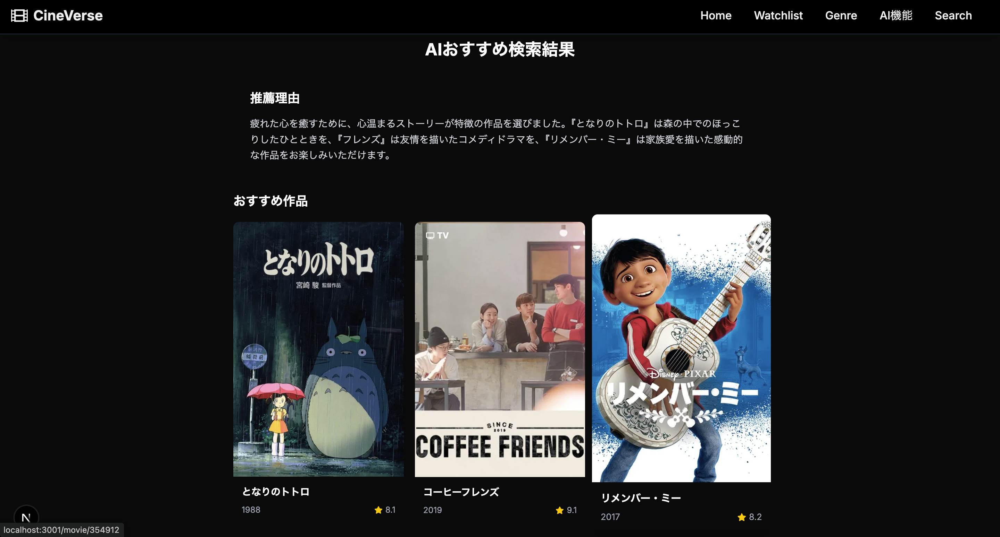

# 🎬 CineVerse


## 🚀 デモ
[CineVerseを体験する](https://cine-verse-ruddy.vercel.app)

映画・アニメ・ドラマの情報を検索・発見できるWebアプリです。  
AIによるおすすめ提案や要約機能も搭載し、ユーザーの好みに合わせた作品探しをサポートします。

---

## 🔍 主な機能

- 映画・アニメ・ドラマの横断検索
- トレンド作品の表示
- 作品詳細ページ（ポスター・あらすじ・評価など）
- ウォッチリスト管理
- アカウント管理（プロフィール編集・削除）
- **AI機能**
  - 気分に合わせたおすすめ作品提案
  - 作品の要約・質問応答
  - レビュー自動生成（開発中）
  - 視聴スケジュール提案（開発中）

---

## 🛠️ これまでの主な作業まとめ

### ヘッダー・ナビゲーション
- ヘッダーのナビゲーションとアバターが重なる問題を、`nav`の`flex-1`を外し`ml-auto mr-8`で右寄せ＋余白を確保することで解決。
- アバターは常に右端固定、ナビゲーションはその左隣に配置されるよう修正。
- レイアウトバランスや余白の調整も複数回行い、ユーザーの要望に応じて微調整。

### ヒーロー画像（トップページ・詳細ページ）
- トップページのHeroCarouselの画像が人物の顔などで見切れやすい問題に対し、`object-position`を`center 30%`→`40%`→`50%`→`35%`→`0%`→`-10%`→`-50%`と段階的に調整し、見え方を最適化。
- トップページと詳細ページのヒーロー画像の高さ（`h-[600px] md:h-[700px]`）やobject-positionを統一。
- 詳細ページのヒーロー画像レイアウトをHeroCarousel風にリファクタリングし、ポスター画像・タイトル・ボタンを重ねて表示。右寄せ・左寄せ・中央寄せなどユーザーの要望に応じて調整。
- ヘッダーとヒーロー画像の間の黒い帯（スペース）を`-mt-20`や`main pt-0`で解消。

### 詳細ページのセクション
- 「More Like This」セクション（類似作品表示）をアニメ・ドラマ詳細ページから削除。

### 検索機能
- 検索ページ（/search）の検索ボタン押下時の処理が未実装だったため、`multiSearch`を使って映画・アニメ・ドラマを横断検索できるよう実装。
- トップページやヘッダーのサーチフォームからもクエリパラメータで遷移した場合に自動で検索が走るように対応。
- 検索結果が表示された後は「Trending Now」セクションを非表示に。
- 検索中は「検索中...」のローディングUIを表示。

---

## 🚀 セットアップ手順

```bash
git clone https://github.com/xxnaokixx/CineVerse.git
cd CineVerse
npm install
npm run dev
```

* `.env.local` に必要な環境変数を設定してください（例: `NEXT_PUBLIC_SUPABASE_URL`、`NEXT_PUBLIC_SUPABASE_ANON_KEY`、`OPENAI_API_KEY`など）。
* 開発サーバーは `http://localhost:3000` で起動します。

---

## 🧑‍💻 開発環境

| 項目      | 使用技術                   |
| ------- | ---------------------- |
| フレームワーク | Next.js 15.x           |
| 言語      | TypeScript, React 18.x |
| スタイリング  | Tailwind CSS           |
| バックエンド  | Supabase（認証・DB）        |
| AI連携    | OpenAI API             |
| デプロイ    | Vercel（予定または済）         |

---

## 🔗 主要なページURL例

| パス                          | 内容                  |
| --------------------------- | ------------------- |
| `/`                         | トップページ（トレンド・検索フォーム） |
| `/search`                   | 作品検索ページ             |
| `/ai`                       | AI機能メニュー            |
| `/movies` `/anime` `/drama` | 各カテゴリ一覧ページ          |
| `/movie/[id]` `/tv/[id]`    | 作品詳細ページ             |
| `/account`                  | アカウント管理ページ          |
| `/watchlist`                | ウォッチリスト             |

---

## 📝 ライセンス

このプロジェクトは **MITライセンス** のもとで公開されています。
詳細は [LICENSE](./LICENSE) ファイルをご覧ください。

---

## 🤝 コントリビューション

バグ報告・機能提案・プルリクエストは大歓迎です！
以下の手順でご参加ください：

1. Issueを確認または新規作成してください
2. `fork` → `feature/your-branch` で作業ブランチを作成
3. 実装とテスト後にプルリクエストを提出

---

## 📌 メモ

特に**認証（ログイン）機能**の実装・調整には多くの時間を要し、セッション管理やUI/UXの細部までこだわって対応しました。

---

## スクリーンショット

### トップページ


### 検索結果ページ


### 作品詳細ページ


### AI機能ページ


### AIレコメンドページ




### AI要約・質問ページ


### ウォッチリストページ


### アカウントページ


---
