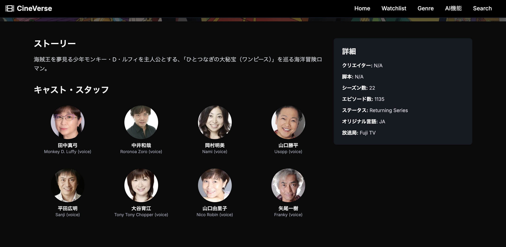

# 🎬 CineVerse


## 🚀 デモ
[CineVerseを体験する](https://cine-verse-ruddy.vercel.app)

映画・アニメ・ドラマの情報を検索・発見できるWebアプリです。  
AIによるおすすめ提案や要約機能も搭載し、ユーザーの好みに合わせた作品探しをサポートします。

---

## 🔍 主な機能

- 映画・アニメ・ドラマの横断検索
- トレンド作品の表示
- 作品詳細ページ（ポスター・あらすじ・評価・VOD配信情報など）
- ウォッチリスト管理（追加・削除・一覧表示）
- アカウント管理（プロフィール編集・削除）
- **認証機能**
  - メールアドレス/パスワード認証
  - Google認証
  - GitHub認証
- **AI機能**
  - 気分やジャンルに合わせたおすすめ作品提案
  - 作品の要約・質問応答（AIによる自然言語回答）
  - レビュー自動生成（開発中）
  - 視聴スケジュール提案（開発中）
- マルチデバイス対応（PC/スマホ/タブレット）
- ダークテーマUI
- 日本語・英語対応（i18n）

---

## 🛠️ これまでの主な作業まとめ

- トップ画面の設計・実装（ヒーロー画像、トレンド作品、検索フォーム、レスポンシブ対応）
- ログイン機能の実装（メール/パスワード、Google認証、GitHub認証）
- アカウント管理機能（プロフィール編集・削除、Watchlist数のAccountページ表示）
- 映画・アニメ・ドラマの横断検索機能
- 作品詳細ページの実装（ポスター・あらすじ・評価・VOD配信情報・シリーズ表示）
- ウォッチリスト機能（追加・削除・一覧表示、Accountページでの件数表示）
- AI機能の実装（おすすめ提案、要約、質問応答、レビュー自動生成、視聴スケジュール提案）
- UI/UXの徹底的な改善（グラデーション・シャドウ・余白・配色・ボタン配置など）
- 多言語対応（日本語・英語）
- ダークテーマUI
- スクリーンショット・README・コントリビューションガイド等のドキュメント整備

### ヘッダー・ナビゲーション
- ヘッダーのナビゲーションとアバターが重なる問題を、`nav`の`flex-1`を外し`ml-auto mr-8`で右寄せ＋余白を確保することで解決。
- アバターは常に右端固定、ナビゲーションはその左隣に配置されるよう修正。
- レイアウトバランスや余白の調整も複数回行い、ユーザーの要望に応じて微調整。

### ヒーロー画像（トップページ・詳細ページ）
- トップページのHeroCarouselの画像が人物の顔などで見切れやすい問題に対し、`object-position`を`center 30%`→`40%`→`50%`→`35%`→`0%`→`-10%`→`-50%`と段階的に調整し、見え方を最適化。
- トップページと詳細ページのヒーロー画像の高さ（`h-[600px] md:h-[700px]`）やobject-positionを統一。
- 詳細ページのヒーロー画像レイアウトをHeroCarousel風にリファクタリングし、ポスター画像・タイトル・ボタンを重ねて表示。右寄せ・左寄せ・中央寄せなどユーザーの要望に応じて調整。
- ヘッダーとヒーロー画像の間の黒い帯（スペース）を`-mt-20`や`main pt-0`で解消。

### 詳細ページのセクション
- 「More Like This」セクション（類似作品表示）をアニメ・ドラマ詳細ページから削除。

### 検索機能
- 検索ページ（/search）の検索ボタン押下時の処理が未実装だったため、`multiSearch`を使って映画・アニメ・ドラマを横断検索できるよう実装。
- トップページやヘッダーのサーチフォームからもクエリパラメータで遷移した場合に自動で検索が走るように対応。
- 検索結果が表示された後は「Trending Now」セクションを非表示に。
- 検索中は「検索中...」のローディングUIを表示。

---

## 🚀 セットアップ手順

```bash
git clone https://github.com/xxnaokixx/CineVerse.git
cd CineVerse
npm install
npm run dev
```

* `.env.local` に必要な環境変数を設定してください（例: `NEXT_PUBLIC_SUPABASE_URL`、`NEXT_PUBLIC_SUPABASE_ANON_KEY`、`OPENAI_API_KEY`など）。
* 開発サーバーは `http://localhost:3000` で起動します。

---

## 🧑‍💻 開発環境

| 項目      | 使用技術                   |
| ------- | ---------------------- |
| フレームワーク | Next.js 15.x           |
| 言語      | TypeScript, React 18.x |
| スタイリング  | Tailwind CSS           |
| バックエンド  | Supabase（認証・DB）        |
| AI連携    | OpenAI API             |
| デプロイ    | Vercel（予定または済）         |

---

## 🔗 主要なページURL例

| パス                          | 内容                  |
| --------------------------- | ------------------- |
| `/`                         | トップページ（トレンド・検索フォーム） |
| `/search`                   | 作品検索ページ             |
| `/ai`                       | AI機能メニュー            |
| `/movies` `/anime` `/drama` | 各カテゴリ一覧ページ          |
| `/movie/[id]` `/tv/[id]`    | 作品詳細ページ             |
| `/account`                  | アカウント管理ページ          |
| `/watchlist`                | ウォッチリスト             |

---

## 📝 ライセンス

このプロジェクトは **MITライセンス** のもとで公開されています。
詳細は [LICENSE](./LICENSE) ファイルをご覧ください。

---

## 🤝 コントリビューション

バグ報告・機能提案・プルリクエストは大歓迎です！
以下の手順でご参加ください：

1. Issueを確認または新規作成してください
2. `fork` → `feature/your-branch` で作業ブランチを作成
3. 実装とテスト後にプルリクエストを提出

---

## 📌 メモ

特に**認証（ログイン）機能**の実装・調整には多くの時間を要し、セッション管理やUI/UXの細部までこだわって対応しました。

---

## スクリーンショット

### トップページ


### 検索結果ページ


### 作品詳細ページ




### AI機能ページ


### AIレコメンドページ


### AI要約・質問ページ


### ウォッチリストページ


### アカウントページ


---

## 🛣️ 今後のロードマップ
- レビュー自動生成機能の正式リリース
- モバイルUIのさらなる最適化
- 国際化（i18n）対応の拡充
- ダーク/ライトテーマ切り替え
- おすすめAIの精度向上

---

## ❓ FAQ（よくある質問）

**Q. AI機能が動かない/エラーになる**  
A. OpenAI APIキーやSupabaseの設定が正しいかご確認ください。APIの無料枠制限にもご注意ください。

**Q. 画像が表示されない**  
A. TMDb APIの画像URLやネットワーク環境をご確認ください。

**Q. ログインできない/認証エラー**  
A. Supabaseの認証設定やメールアドレス・パスワードをご確認ください。

---

## 📝 コントリビューションガイド
- 新機能は必ずIssueを立ててからPRを作成してください
- コードはPrettier/TailwindのLintに準拠してください
- ブランチ名は `feature/xxx` や `fix/xxx` など分かりやすく
- レビューは原則2名以上で行います

---

## 🙏 クレジット・謝辞
- [TMDb API](https://www.themoviedb.org/)（映画・アニメ・ドラマ情報）
- [Supabase](https://supabase.com/)（認証・DB）
- [OpenAI API](https://openai.com/)（AI要約・レコメンド）
- [Vercel](https://vercel.com/)（デプロイ）
- 各種OSS・デザインリソース

---

## 🖼️ スクリーンショットの説明
- トップページ：ヒーロー画像・トレンド作品・検索フォーム
- 検索結果ページ：横断検索結果の表示
- 作品詳細ページ：映画・アニメの詳細情報、VOD配信情報
- AI機能ページ：AIによるおすすめ・要約・質問応答
- ウォッチリストページ：お気に入り作品の管理
- アカウントページ：プロフィール編集・削除

---

## 👤 開発者・運営者
- Naoki Ogawa（xxnaokixx）
- [GitHub](https://github.com/xxnaokixx-zzz)
- [Twitter](https://twitter.com/xxnaokixx)（例）
- お問い合わせ: info@example.com

---

## 🗒️ バージョン情報・更新履歴
- v1.0.0: 初期リリース
- v1.1.0: AI要約・レコメンド機能追加
- v1.2.0: UI/UX大幅改善・スクリーンショット追加
- v1.3.0: README充実化・バッジ/デモリンク追加

---

## 🎨 UI/UXへのこだわりと改善ポイント

CineVerseは「使いやすさ」と「見やすさ」を徹底的に追求し、何度も細かい修正を重ねてきました。

- **ヘッダー・ナビゲーション**
  - ロゴ・ナビ・アバターのバランスや余白を何度も調整し、どんな画面幅でも美しく見えるように工夫
  - アバターは常に右端固定、ナビゲーションはその左隣に配置し、重なりやズレを徹底排除

- **ヒーロー画像・トップビジュアル**
  - 画像のobject-positionや高さを何度も微調整し、人物の顔やタイトルが見切れないよう最適化
  - テキストの可読性を高めるため、グラデーション帯やシャドウを追加し、背景に左右されず読みやすく
  - レスポンシブ対応も重視し、スマホ・タブレットでも美しく表示

- **詳細ページ・ボタン配置**
  - ポスター画像・タイトル・ボタンの重なりや配置をHeroCarousel風にリファクタリング
  - VODボタンやウォッチリストボタンなど、ユーザーが直感的に操作できるよう配置やデザインを工夫

- **検索・AI機能**
  - 検索結果やAIのおすすめ・要約も、カード型やローディングUIなどで分かりやすく表示
  - 検索中や結果なしのときも、ユーザーが迷わないよう配慮

- **全体の配色・余白・フォント**
  - ダークテーマを基調に、アクセントカラーや余白、フォントサイズも細かく調整
  - どんな作品画像でも映えるよう、UIの一体感と高級感を意識

> UI/UXは「一度作って終わり」ではなく、実際に触ってみて気になる点を何度も修正し、ユーザー目線で徹底的に磨き上げました。

---

## ✅ 動作確認・テストについて

- 現在は主に手動テスト（実際に画面を操作しての動作確認）を中心に行っています。
- 主要なページ（トップ・検索・詳細・AI機能・アカウント管理など）を一通り操作し、UI/UXや機能の不具合がないかを確認しています。
- 今後はJestやPlaywrightなどによる自動テストの導入も検討しています。
- バグ報告や再現手順はIssueにてご協力いただけると助かります。

---

> 本プロジェクトは基本的に一人で開発を進めているため、動作が不安定な箇所や見落としがあるかもしれません。もしバグや改善点などお気づきの点があれば、IssueやPR等でご教示いただけますと幸いです。

---

### AI機能について

CineVerseではOpenAI APIを活用し、以下のAI機能を実装しています：
- おすすめ作品の自動提案（ユーザーの気分やジャンルに応じて）
- 作品の要約生成・質問応答（自然言語で分かりやすく解説）
- レビュー自動生成（今後拡張予定）
- 視聴スケジュールの自動提案（今後拡張予定）

---
